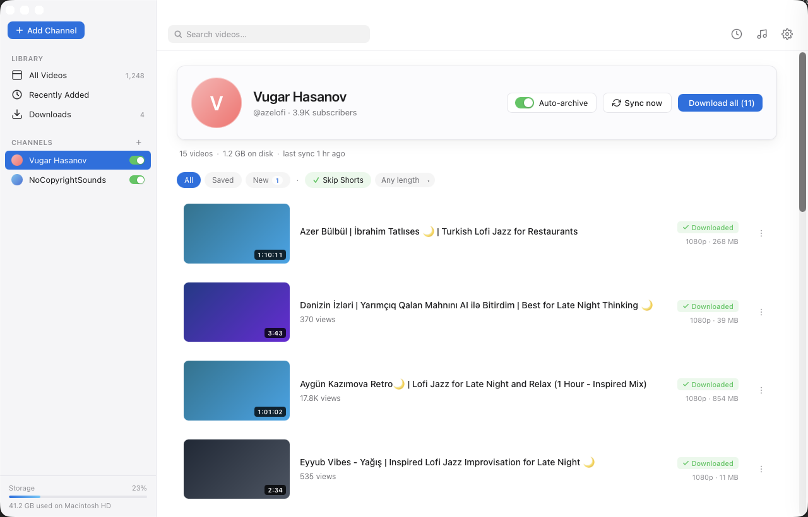

# Lasso

[](./LICENSE)
[](https://github.com/nsozturk/lasso/commits/main)
[](https://github.com/nsozturk/lasso)
[](https://github.com/nsozturk/lasso)
[](https://github.com/nsozturk/lasso/issues)
[](https://github.com/nsozturk/lasso/stargazers)

> Subscribe to a YouTube channel — Lasso archives every video to your disk.



Lasso is a local-first desktop app that subscribes to YouTube channels and
auto-downloads new uploads as they appear. It targets the gap between
server-tier tools (TubeArchivist, Pinchflat) that need Docker, and one-off
downloaders (Parabolic, Tartube) that don't really do "subscribe and watch".

**Status:** early alpha. macOS-only build. Works end-to-end on the author's
machine — channel add → live progress → file on disk. Not packaged into a
.dmg yet; run from source.

## Features today

- Add a channel by URL (`youtube.com/@name`) — Lasso fetches channel
  metadata + the first video instantly, then **streams the rest in the
  background** while the UI shows skeleton placeholders that get replaced as
  videos arrive. Big-catalog channels (NCS, GMM, etc.) become usable
  immediately instead of blocking for 30+ seconds.
- One-click download with **live percentage + progress bar** per video card.
- Per-channel quality preference: 1080p / 720p / Best, MP4 / WebM / MKV.
- **Per-channel mode** — `video` or `audio`. Music channels in audio mode
  download as the default audio format.
- **Audio extraction** — MP3, M4A, FLAC, OPUS, WAV, OGG (Vorbis), AAC, ALAC.
  Triggered by channel mode or per-video via the `⋮` menu on each video card.
- **Audio Settings sheet** (♪ icon in toolbar) — default audio format and
  bitrate / quality.
- **"Download all"** button on the channel header — opens a sheet that asks
  whether to save as Video (with quality + container choice — MP4 / WebM /
  MKV) or Audio (any of MP3 / M4A / FLAC / OPUS / WAV / OGG / AAC / ALAC),
  then queues every pending or failed video with that recipe. The background
  worker honours the `concurrent_downloads` setting (default 1) and runs
  jobs N-at-a-time, keeping the rest in a visible "Queued" state.
- **"Stop all"** button when downloads are in flight — aborts every running
  task and clears the queue.
- **Cancel** button (× next to the chip) on running or queued downloads —
  aborts yt-dlp and resets the video so it can be retried.
- "Sync now" button refreshes a channel's recent uploads.
- **Background auto-sync** — every channel marked Auto-archive is re-checked
  every N minutes (configurable in Settings, default 60). New uploads land in
  the DB and the UI picks them up on the next poll.
- Search (live filter), filter pills (All / Saved / New), Skip Shorts toggle,
  minimum-duration filter.
- Settings sheet: default save folder, default quality / format, default
  backlog size, Skip Shorts default, concurrent download count.
- Auto-archive toggle per channel (sidebar + channel header).
- Apple-vari light theme. macOS native title bar (overlay traffic lights).

## Coming soon

- **Pause / resume buttons.** Cancel works today (yt-dlp child is
  SIGKILLed via `kill_on_drop`); pause via `SIGSTOP` + resume via
  `SIGCONT` and a new `paused` DB state is the next step.
- **Tauri event channel for progress.** Today the frontend polls
  `get_active_downloads`/`get_fetch_progress` every 1 to 1.5 seconds;
  switching to backend `app.emit(...)` would drop the polling overhead.
- **Auto-download** on auto-sync — newly discovered videos in
  `auto_archive=true` channels currently land in DB as `pending`. A
  follow-up could enqueue them automatically via the coordinator.
- macOS `.dmg`, Linux AppImage, Windows `.exe` releases —
  `scripts/fetch-binaries.sh` already knows the platforms; running
  `pnpm tauri build` after `./scripts/fetch-binaries.sh` produces a
  bundled installer.

## Run from source

Requirements: macOS 13+, Node 20+, [pnpm](https://pnpm.io), Rust toolchain
(`rustup`). `yt-dlp` and `ffmpeg` are **embedded** — fetched once into
`src-tauri/binaries/` by a script and bundled into the `.app` by Tauri.
You don't need them on PATH.

```sh
brew install pnpm rustup-init           # if you don't have these
rustup-init -y && source "$HOME/.cargo/env"

git clone https://github.com/nsozturk/lasso.git
cd lasso
pnpm install
./scripts/fetch-binaries.sh             # downloads yt-dlp + ffmpeg
pnpm tauri dev
```

First run seeds a default channel (`@azelofi`) so you have something to play
with immediately. Try also: `https://www.youtube.com/@NoCopyrightSounds` —
a busy music channel that's a great showcase for audio extraction
(channel mode = audio + format = FLAC, then "Download all").

Files land in `~/Movies/Lasso/<Channel-Name>/`. Channel names with spaces
are sanitised to `-` to keep paths shell-safe.

## Stack

| Layer       | Tech                                           |
|-------------|------------------------------------------------|
| Shell       | [Tauri 2](https://tauri.app) (Rust)            |
| UI          | React 19 + Vite + TypeScript, hand-rolled CSS  |
| Storage     | SQLite (`rusqlite` with bundled feature)       |
| Downloader  | `yt-dlp` subprocess + `ffmpeg` for merge       |
| State       | `Arc<Mutex<HashMap>>` for in-flight progress   |

## Architecture

A thin Rust shell (Tauri 2) hosts a React WebView. The Rust side owns the
SQLite database and a shared progress map. Each download spawns a `yt-dlp`
child process whose stdout is parsed line-by-line via a custom
`--progress-template`; parsed updates land in the shared map. The frontend
polls the map every second while any download is in-flight and re-renders
percentages and progress bars. Channel folder names are sanitised
(spaces → `-`) to keep filesystem paths shell-safe. Schema migrations are
additive `ALTER TABLE` calls that fail-silently when the column already
exists.

## Legal note

YouTube's Terms of Service prohibit downloading content. This software is
intended for the end user's **personal backup / archival** of channels they
have a legitimate reason to preserve. Distributing copyrighted material
without permission is illegal. The user assumes all responsibility. The
maintainers are aware this puts the project at DMCA risk and are okay with
that.

## Credits

Lasso is a thin shell around tools written by other people. Without these,
the project simply could not exist:

- **[yt-dlp](https://github.com/yt-dlp/yt-dlp)** ([@yt-dlp](https://github.com/yt-dlp))
  — the YouTube extraction engine. Unlicense / public-domain dedication.
  Lasso uses it for channel metadata, video fetching, and audio extraction.
- **[FFmpeg](https://ffmpeg.org/)** ([@FFmpeg](https://github.com/FFmpeg))
  — the muxing, container conversion, and audio re-encoding workhorse that
  yt-dlp delegates to.
- **[Tauri](https://tauri.app)** ([@tauri-apps](https://github.com/tauri-apps))
  — the desktop shell (Rust + system WebView).
- **[React](https://react.dev)** ([@facebook](https://github.com/facebook))
  — the UI runtime.
- **[Vite](https://vitejs.dev)** ([@vitejs](https://github.com/vitejs)) and
  **[rusqlite](https://github.com/rusqlite/rusqlite)** ([@rusqlite](https://github.com/rusqlite))
  for build tooling and SQLite bindings.

If you maintain one of the above and would like a different attribution
form, open an issue.

## License

MIT — see [LICENSE](./LICENSE).
